# Microsoft Learn Student Ambassadors introduction to Microsoft Healthbot

The Microsoft Healthcare Bot service empowers healthcare organizations to build and deploy an AI-powered, compliant, conversational healthcare experience at scale. The service combines built-in medical intelligence with natural language capabilities, extensibility tools and compliance constructs, allowing healthcare organizations such as Providers, Payers, Pharma, HMOs, Telehealth to give people access to trusted and relevant healthcare services and information.

The aim of this module is to understand the different functionalities and show what capabilities that the health bot has.

This framework is the ideal starting point for you developing your first (Health) Bot project.

To start your Health Bot project, you can create the service via the Azure portal. You first need to create your Azure Subscription. So if your a student simply head over to [Azure for Student](http://aka.ms/azure4students)

## Setting up your Health Bot 

Create a new Health Bot Service via the Azure Portal

Just fill in the required properties, such as Name, Subscription, Resource group, Location and Plans.
When the services has been created, you should see a similar screen

The Health Bot Service details screen after creation. 

To start using the Health Bot Service, you will need to click on Configure Account , this will redirect you to the Admin portal, where you can start configuring your bot.

## Scenario Editor

The initial screen invites you to create new scenario’s. The Health Bot has great functionality to create, debug, test and manage scenarios.

Start screen Health Bot Dashboard

Let’s try creating a new scenario, by clicking on Open scenario template catalog 

The Health Bot Service has different templates available that can kickstart your bot project. The templates contains pre defined scenario’s, where you can start from.

Healthbot Template Catalog

For this demo, let’s create the File a claim template.

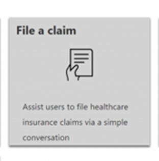

When selecting this option, you will need to enter a scenario name.

## Select the new claim template from the catalog. 

After importing the scenario, you will be redirected to the Scenario Editor. The Scenario Editor is a very strong feature of the Health Bot, It has a number of visual capabilities to create, test and run chatbot scenario’s in the browser.

Here is a high-level overview of the Scenario Editor.

We have amazing docs at Microsoft Doc, more information on the Healthbot can be found [here](https://docs.microsoft.com/HealthBot/scenario-authoring/scenario-elements)

1.	The upper bar contains functionality to Save your scenario, but also to Run the scenario in the browser, this can be done with arguments and a snapshot of the scenario can also be created
2.	The Author has a broad range of scenario elements that can be used to create your scenario.
3.	Every scenario element is visualized and connected with each other. When you click on an element, you can view and edit the behavior of that element.
4.	When you Run the scenario in the portal, you can test the scenario and interact with the bot via the Chat window
5.	The Info window can be seen as a small debugger when running the scenario, it has also a Watch and Immediate window.
6.	The Designer contains relevant information when running the scenario.

When clicking on different elements you will see the details, with the possibility to change the properties such as display text, variable name, coded choices, backend communication.

These properties are different per type or dialog element.

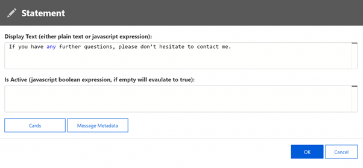

Statement details, with support for rich cards

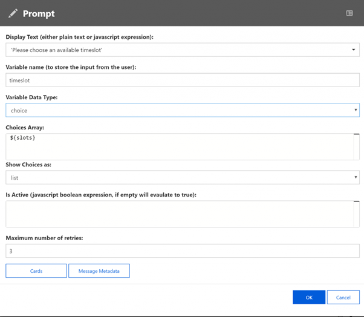

Support for prompts with variable input

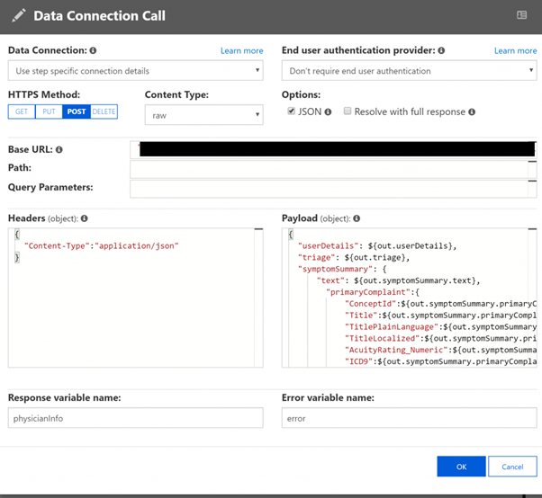

Connect to your own backend systems

When combining these building blocks, any functional user can create their own dialog scenarios without having to code. When interaction of backend systems is needed, some minor programming knowledge is needed.

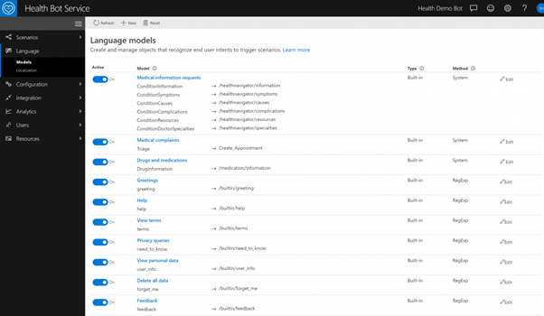

## Built in Language Models

The Health Bot Service has several built in language models, to support out of the box scenario’s, such as medical complaints, privacy issues.

The built-in language models are backed by LUIS, the Natural Language Processing NLP service from Microsoft. It is also possible to create your own language models with LUIS, Regex or even QnA maker. 

To create your new NLP Language model, you can link a LUIS model to the bot by providing the needed keys and secrets. Otherwise you can create a simple regex model.

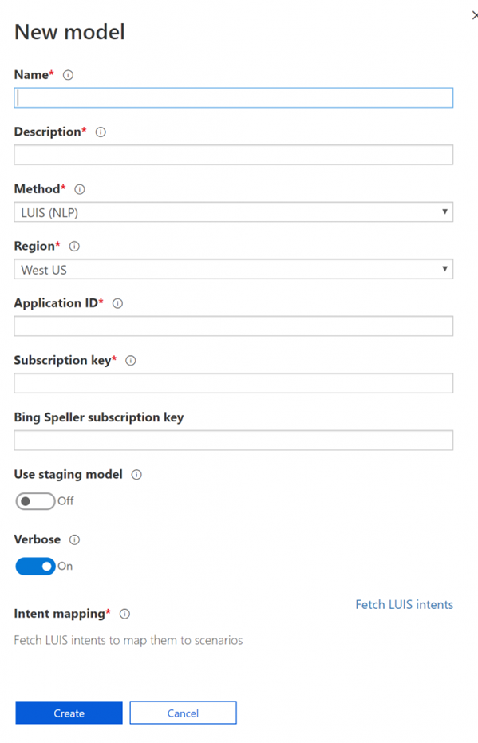

## Link your own Language Model to the bot

Another very important language feature, is the possibility to translate your scenario’s. These translations can be exported and imported for translation purposes.

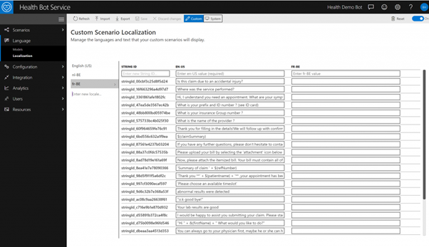

## Configuration

The Health Bot Service can be easily configured, these options are divided in 3 logical parts, Medical – Compliance – Conversation.

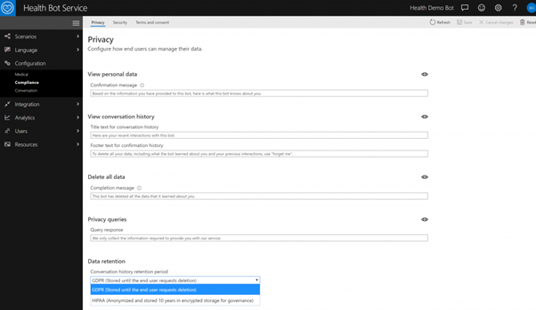

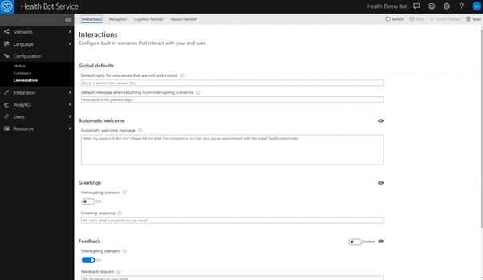

I will not go through all the different configuration options, as this could easily be a module its own. But to give you an idea of the extensibility.

## Human Hand off

The following screenshots shows how you can enable Human Handoff or Interrupting Scenarios

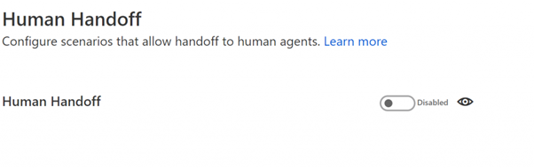

With the Human Handoff option, you have the possibility to redirect the bot conversation to a live agent. This could be triggered by a sentiment analysis. When redirecting the conversation, the person will have an overview of what has been said to the bot, to understand the context and respond in the best way possible.

The Health bot Service also contains different interrupting scenarios, these can be enabled for certain conversation subjects and are an easy way to step in, if needed.

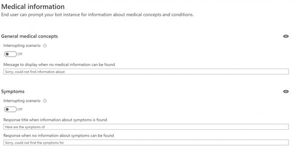

## Integration

The Health Bot Service can interact with your backend systems. With the Data connections configuration, the bot can easily fetch or store data via REST APIs. These connections can be easily secured with the help of standard authentication protocols such as oAuth..

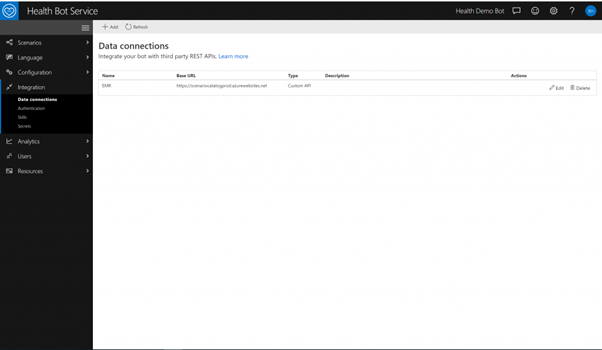

An overview of the available data connections of the bot

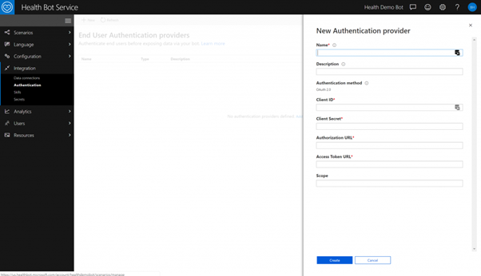

You can easily link your bot to a backend system

The Health Bot Service can also communicate with FHIR compliant API’s. When you add a new data connection, you will have the possibility to add a FHIR supported API. With this option your bot can fetch or store FHIR entities.

When adding a data connection, there is also support for FHIR
The Health Bot Service also has Secrets and Keys, to support your bot, or create secrets to connect with your backend system.

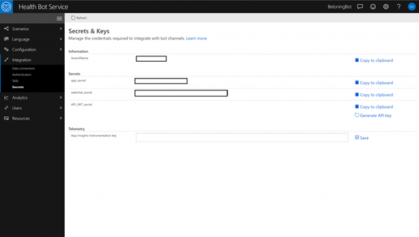

An overview of your secrets and keys

## Analytics

When you create bot scenario’s, you will notice that sometimes your bot does not understand what the intent of the user is. To constantly make your bot smarter and richer, you can rely on the Unrecognized utterances view.
This view contains all the questions that could not be answered by the bot. By monitoring and anticipating on these unrecognized utterances, you can create or extend your scenarios with the information you get by this view.

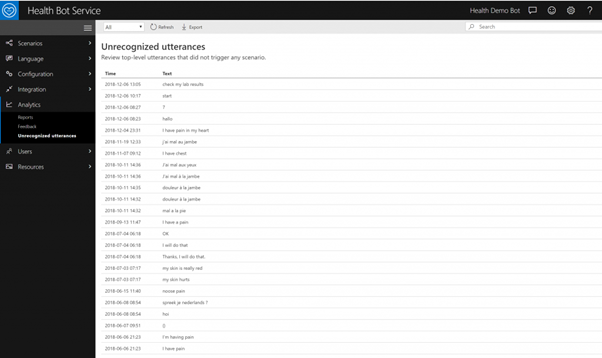

An overview of all the unrecognized utterances

The Health bot Service also has an extensive report section, that gives you different insights on the usage of the bot. This varies from the unique users, messages to unrecognized utterances.

## Reporting 
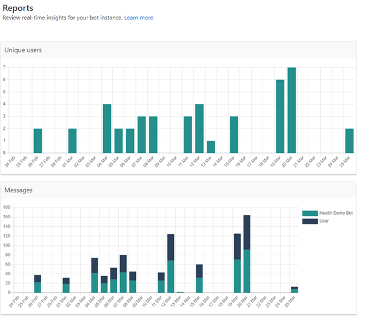

Unique Users and message report

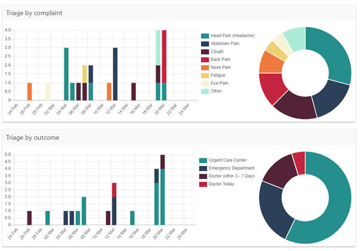

Triage analytics

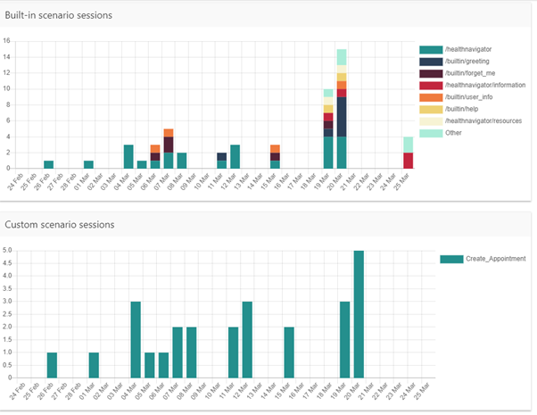

Built in scenario’s reporting examples

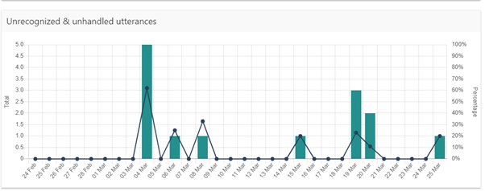

Unrecognized & unhandled utterances

## Users

The Healthbot Service has a User Mangement Portal, where you can manage the users that can access the portal.

User Management portal

## User Management Auditing 

We are working with potential patient data, the service provides an extensive audit trail of who is using the service.

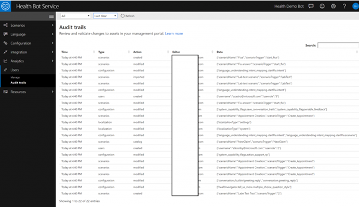

## Resources

You can upload your own images or use your own variables in the Health Bot Service. You can then extend your messages with images to make it more interactive.

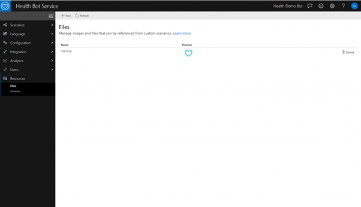

## Custom Resources

I hope that you now have a better understanding on how the Health Bot Service could be a perfect starting point for your bot journey. If you want to give this a spin, I suggest to create a free version of the Health Bot Service via the Azure Portal.

## Documentation & Additional Resources

https://docs.microsoft.com/HealthBot
